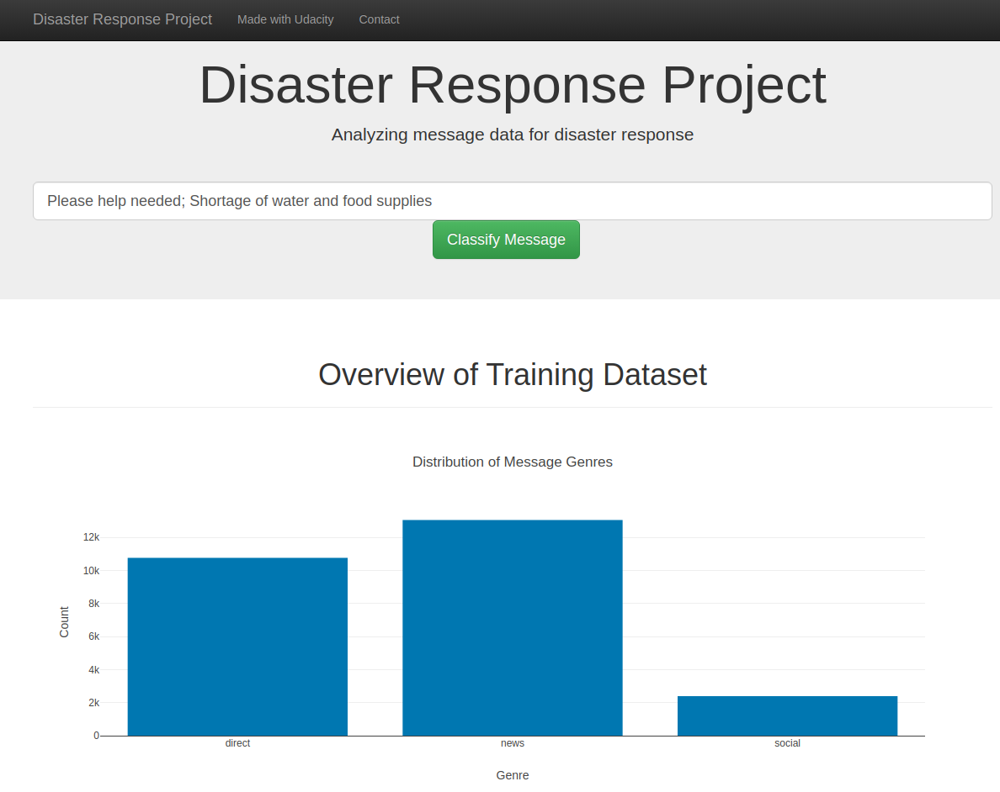
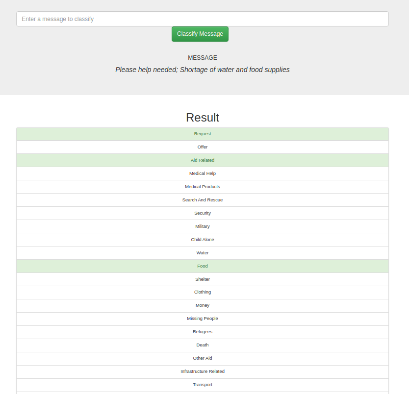

# Disaster Response Pipeline Project
Disaster Response Pipeline is a part of Udacity Nanodegree in Data Science. This is a project where the datasets are  
fetched, cleaned and transformed as per ETL to a dataset over which ML algorithm could be run and studied. NLTK package is used to  
learn the dataset from the tweets collected by the company Figure Eight and classify the tweet to one of the 36  
categories.

### Contents
- App : Files to be used for Flask Webapp
- Data : Messages and Categories files corresponding to Disaster. Process_Data.py is used to fetch, clean and create Database from csv files.
- Model : Machine Learning Classifier algorithm to train the data and save the pickle file.
- Jupyter Notebook files to construct ETL and ML pipelines.

### Libraries 
* pandas, sqlalchemy
* nltk, sklearn

### 

### Webapp Outlook

### Instructions:
1. Run the following commands in the project's root directory to set up your database and model.

    - To run ETL pipeline that cleans data and stores in database
        `python data/process_data.py data/disaster_messages.csv data/disaster_categories.csv data/DisasterResponse.db`
    - To run ML pipeline that trains classifier and saves
        `python models/train_classifier.py data/DisasterResponse.db models/classifier.pkl`

2. Run the following command in the app's directory to run your web app.
    `python run.py`

3. Go to http://0.0.0.0:3001/
